# YMZ294

Yamaha の FM 音源 YMZ294 を使って音楽を再生するためのライブラリ（チュートリアルもあるよ！）

<blockquote class="twitter-tweet">
YMZ294でロックマン <a href="https://t.co/W3yztZKuT6">pic.twitter.com/W3yztZKuT6</a>
&mdash; Канадэ (@kanade_k_1228) <a href="https://twitter.com/kanade_k_1228/status/1464302691882967043?ref_src=twsrc%5Etfw">November 26, 2021</a></blockquote> 

## 必要な部品

- [YMZ294](https://akizukidenshi.com/catalog/g/gI-12141/){:target="\_blank"}
- [4MHz 発振器](https://akizukidenshi.com/catalog/g/gP-10387/){:target="\_blank"}
- [スピーカー](https://akizukidenshi.com/catalog/g/gP-03285/){:target="\_blank"}
- 抵抗 10kΩ
- 抵抗 100Ω
- Arduino
- ブレッドボード
- ジャンパワイヤ
- USB ケーブル (Arduino - PC)

## チュートリアル

1. ソースコードをダウンロード
   - [リポジトリのページ](https://github.com/kanade-k-1228/YMZ294/){:target="\_blank"} 右上の Code から、zip を選択しダウンロード
   - または、コマンドライン上で `git clone https://github.com/kanade-k-1228/YMZ294.git`
2. ライブラリのインクルード
   - ダウンロードした `YMZ294/libralies` に含まれる `PlayMusic` と `YMZ294` を
   - Arduino のライブラリが置いてあるディレクトリに移動
     - Windows なら `C:\Users\[ユーザー名]\Documents\Arduino\libraries`
3. ライブラリのテスト
   - ArduinoIDE で `YMZ294/sample/00_include` を開いて、
   - 「検証」を押してみて、エラーが起きなければ、無事にインストール完了です！
4. ブレッドボードで配線
5. テスト
   - ArduinoIDE で `YMZ294/sample/01_sound` を開いて、
   - ボードの設定を確認して、
   - 書き込み！

## トラブルシューティング

- 音が出ない！！！
  - 接続されているピン番号は合っていますか？（根気よく確かめて…）
  - SO-GND 間に抵抗は繋いでいますか？

## YMZ294 のしくみ

> 音が生成されるまでの流れを解説するよ！ [データシート](./ymz294.pdf){:target="\_blank"} の図を参照してね！

1. 楽音発生器
   - ある決まった周波数の矩形波（四角形の波）を生成します
   - 正弦波（音叉のようなきれいな音）ではない
   - 基準クロックを分周して生成している
2. ミキサー
   - 各チャンネルごとの ON/OFF を切り替えます
   - （リアルのミキサーと違って）音量はここでは調整しないことに注意
3. 音量調整
   - 各チャンネルごとの音量を調整します
   - 音量はデシベル値で設定します
     - デシベルは `dB = log10` 対数であることに注意

### YMZ294 のしくみ（詳細版）

> 「ノイズ」「エンベロープ」という機能を使うとより豊かな表現ができるよ！

1. 楽音発生器
2. ノイズ発生器
3. ミキサー
4. エンベロープ発生器
5. 音量調整

### ライブラリの使い方

> 「sample」の中にサンプルコードがあるのでいろいろ試してみて！

1. YMZ294 のピンがどこに繋がっているかを設定します
   - `YMZ294 sound()`
2. `setup` 関数の中で、ピンのセットアップと、YMZ294 のリセットをします
   - `sound.setup_pin()`
   - `sound.reset_registers()`
3. 音の設定をして再生します

## 高度な使い方

### 好きな音楽を再生する

1. MIDI エディタで曲を打ち込む
   - [Domino](https://takabosoft.com/domino){:target="\_blank"} がおすすめ
   - Domino 用のテンプレートファイルが `sample/07_play_music/template.dms` にあります
   - 曲を打ち込んだら `.mid` ファイルを出力
2. `.midi` を `.h` に変換する
   - [Midifles](https://github.com/kanade-k-1228/midifile) に変換プログラムがあるので、
   - `cd`
   - `git clone https://github.com/kanade-k-1228/midifile.git`
   - `cd midifile`
   - `make midi2ymz`
   - して、プログラムをビルドしてください
   - `~/midifile ???.mid > ???.h` で変換します（`???` は自分で作った midi ファイル名を入れる）
3. include して書き込む
   - `???.h` を `sample/07_play_music` 内に移動します
   - `07_play_music.ino` の先頭の `#include "XXX.h"` を `#include "???.h"` に書き換えます
   - エラーが出た場合
     - メモリが足りない？
     - `PROGMEM` が悪さをしてる？

`sample/06_play_rockman` の `loop()` を見ると、たくさんの `play_sound()` と `delay()` が並んでいます。このやり方では、Arduino のプログラムメモリを無駄遣いしてしまい、長い曲を再生できません。このため、ここだけのデータフォーマットを作って曲のデータを表現しています。

|     |     |                 |                                                                   |
| --- | --- | --------------- | ----------------------------------------------------------------- |
|     | 15  | 0:Delay 1:Sound | 切り替えます                                                      |
|     |     | IF Delay        |                                                                   |
| 14  | 0   | Delay Time [ms] |                                                                   |
|     |     | IF Sound        |                                                                   |
| 14  | 13  | Chip Sellect    | 複数接続しない場合、チップセレクトは不要です                      |
| 12  | 11  | Channel         | 1~3 のチャンネル番号を指定 0 番は予約済（ノイズ周波数に使う予定） |
| 10  | 4   | Note Number     |                                                                   |
| 3   | 0   | Velocity        |                                                                   |

### 複数接続

YMZ294 は 矩形波 3 チャンネルしかありません。ファミコンは矩形波 2 Ch + 三角波 1 Ch + ノイズ 1 Ch あるので、ファミコンの曲を再生しようとすると少し足りなかったりします。

ノイズを再生しようとすると、ノイズと矩形波の個別の音量調整ができないので、結局チャンネルを一つつぶすことになります。

YMZ294 には、「/CS」（チップセレクト）というピンがあり、これを使って複数の YMZ294 を並列に接続できます。

Arduino ピンが足らなくなるので、シフトレジスタを使って拡張します。

